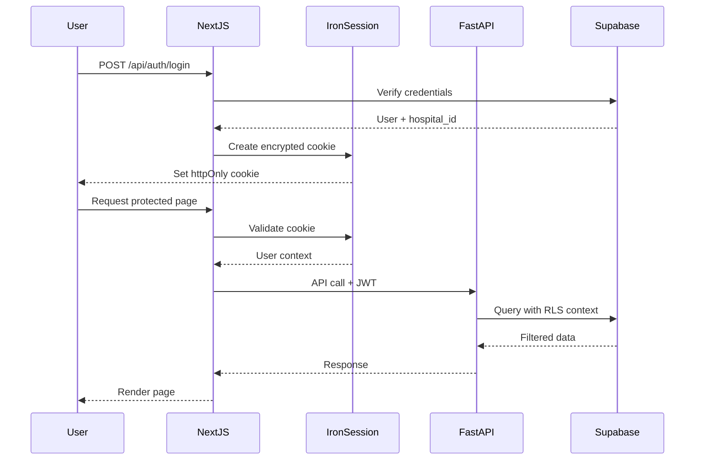
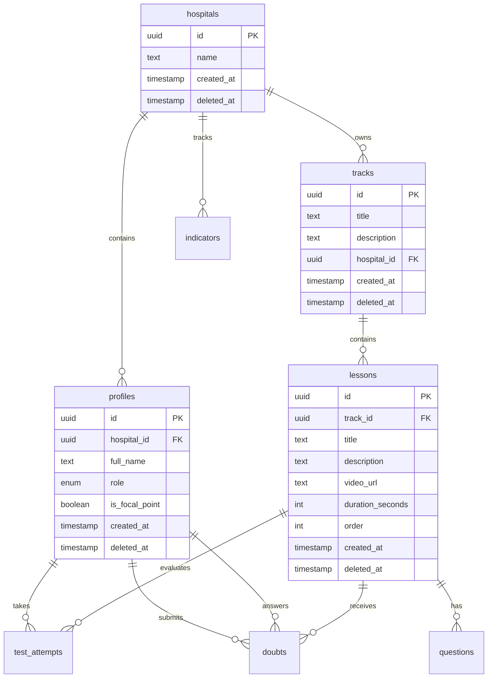

# Design Document: SL Academy Platform

## Overview

SL Academy is a B2B hospital education and management platform that combines microlearning with indicator tracking to improve protocol adherence and patient safety. The platform serves two primary user groups: doctors who consume short educational content (5-15 minute lessons) and take assessments, and managers/directors who monitor training effectiveness through dashboards and manage hospital indicators. The system uses a multi-tenant architecture with hospital-level data isolation, integrating video-based learning, knowledge assessments, doubt management, and performance analytics into a unified PWA experience.

The platform addresses the critical challenge of low protocol adherence in hospitals by providing accessible, bite-sized training content that fits into busy medical schedules, while giving hospital leadership real-time visibility into training completion and its correlation with safety indicators. Focal point doctors serve as training replicators, accessing specialized support materials to conduct in-person training sessions.

## Architecture

### System Architecture Overview

```mermaid
graph TB
    subgraph "Client Layer"
        PWA[PWA - Next.js 16]
        Mobile[Mobile Browser]
        Desktop[Desktop Browser]
    end
    
    subgraph "Application Layer"
        NextJS[Next.js App Router]
        API[FastAPI Backend]
        Auth[Iron-Session Auth]
    end
    
    subgraph "Data Layer"
        Supabase[Supabase PostgreSQL]
        Storage[Supabase Storage]
        RLS[Row Level Security]
    end
    
    subgraph "External Services"
        AI[OpenAI/Claude API]
        Video[Video CDN]
    end
    
    PWA --> NextJS
    Mobile --> NextJS
    Desktop --> NextJS
    NextJS --> Auth
    NextJS --> API
    API --> Supabase
    API --> Storage
    API --> AI
    Supabase --> RLS
    NextJS --> Video
    
    style PWA fill:#2d3748
    style API fill:#2d3748
    style Supabase fill:#2d3748


### Multi-Tenant Isolation Strategy

```mermaid
graph LR
    subgraph "Hospital A"
        UA[Users A] --> DA[Data A]
    end
    
    subgraph "Hospital B"
        UB[Users B] --> DB[Data B]
    end
    
    subgraph "Supabase RLS"
        Policy[RLS Policies]
        Filter[hospital_id Filter]
    end
    
    DA --> Policy
    DB --> Policy
    Policy --> Filter
    
    style Policy fill:#48bb78
    style Filter fill:#48bb78
```

The platform implements strict multi-tenant isolation at the database level using Supabase Row Level Security (RLS). Every data access query is automatically filtered by the authenticated user's hospital_id, preventing any cross-hospital data leakage. This approach ensures that:

- Hospital A users can only access Hospital A data
- Managers see only their hospital's indicators and user activity
- Doctors see only lessons and tracks assigned to their hospital
- All file uploads (images, spreadsheets) are scoped to the owning hospital

### Authentication Flow




## Components and Interfaces

### Frontend Components (Next.js + TypeScript)

#### Core Layout Components

```typescript
interface SidebarProps {
  user: UserProfile
  currentPath: string
}

interface UserProfile {
  id: string
  fullName: string
  role: 'manager' | 'doctor'
  isFocalPoint: boolean
  hospitalId: string
}

interface LayoutProps {
  children: React.ReactNode
  user: UserProfile
  showSidebar?: boolean
}
```

#### Video Player Component

```typescript
interface VideoPlayerProps {
  videoUrl: string
  lessonId: string
  onComplete: () => void
  onProgress: (seconds: number) => void
}

interface VideoMetadata {
  duration: number
  currentTime: number
  isPlaying: boolean
  isFullscreen: boolean
}
```

#### Test Component

```typescript
interface TestQuestion {
  id: string
  questionText: string
  options: string[]
  correctOptionIndex: number
}

interface TestAttempt {
  lessonId: string
  type: 'pre' | 'post'
  answers: Record<string, number>
  score: number
  startedAt: Date
  completedAt?: Date
}
```


#### Doubt Management Components

```typescript
interface Doubt {
  id: string
  profileId: string
  lessonId: string
  text: string
  imageUrl?: string
  status: 'pending' | 'answered'
  answer?: string
  answeredBy?: string
  aiSummary?: string
  createdAt: Date
}

interface KanbanBoardProps {
  doubts: Doubt[]
  onMoveDoubt: (doubtId: string, newStatus: Doubt['status']) => void
  onAnswerDoubt: (doubtId: string, answer: string) => void
}

interface DoubtCardProps {
  doubt: Doubt
  onAnswer?: (answer: string) => void
  viewMode: 'doctor' | 'manager'
}
```

#### Dashboard Components

```typescript
interface Indicator {
  id: string
  hospitalId: string
  name: string
  value: number
  category: string
  referenceDate: Date
}

interface ChartData {
  labels: string[]
  datasets: {
    label: string
    data: number[]
    color: string
  }[]
}

interface DashboardProps {
  indicators: Indicator[]
  testScores: TestAttempt[]
  completionRates: Record<string, number>
}
```


### Backend API Interfaces (FastAPI + Pydantic)

#### Authentication Models

```python
from pydantic import BaseModel, EmailStr
from enum import Enum
from datetime import datetime
from typing import Optional

class UserRole(str, Enum):
    MANAGER = "manager"
    DOCTOR = "doctor"

class LoginRequest(BaseModel):
    email: EmailStr
    password: str

class UserProfile(BaseModel):
    id: str
    hospital_id: str
    full_name: str
    role: UserRole
    is_focal_point: bool
    created_at: datetime
```

#### Track and Lesson Models

```python
class Track(BaseModel):
    id: str
    title: str
    description: str
    hospital_id: str
    created_at: datetime
    deleted_at: Optional[datetime] = None

class Lesson(BaseModel):
    id: str
    track_id: str
    title: str
    description: str
    video_url: str
    duration_seconds: int
    order: int
    created_at: datetime
    deleted_at: Optional[datetime] = None

class LessonDetail(Lesson):
    track: Track
    questions_count: int
```


#### Test and Assessment Models

```python
class QuestionType(str, Enum):
    PRE = "pre"
    POST = "post"

class Question(BaseModel):
    id: str
    lesson_id: str
    type: QuestionType
    question_text: str
    options: list[str]
    correct_option_index: int
    created_at: datetime

class TestAttemptCreate(BaseModel):
    lesson_id: str
    type: QuestionType
    answers: dict[str, int]  # question_id -> selected_option_index

class TestAttemptResponse(BaseModel):
    id: str
    profile_id: str
    lesson_id: str
    type: QuestionType
    score: float
    answers: dict[str, int]
    started_at: datetime
    completed_at: datetime
```

#### Doubt Models

```python
class DoubtStatus(str, Enum):
    PENDING = "pending"
    ANSWERED = "answered"

class DoubtCreate(BaseModel):
    lesson_id: str
    text: str
    image_url: Optional[str] = None

class DoubtUpdate(BaseModel):
    answer: str

class Doubt(BaseModel):
    id: str
    profile_id: str
    lesson_id: str
    text: str
    status: DoubtStatus
    answer: Optional[str] = None
    answered_by: Optional[str] = None
    ai_summary: Optional[str] = None
    created_at: datetime
    deleted_at: Optional[datetime] = None
```


#### Indicator Models

```python
class IndicatorCreate(BaseModel):
    name: str
    value: float
    category: str
    reference_date: datetime

class Indicator(BaseModel):
    id: str
    hospital_id: str
    name: str
    value: float
    category: str
    reference_date: datetime
    created_at: datetime

class IndicatorImportRequest(BaseModel):
    data: list[IndicatorCreate]
    source: str  # "csv", "google_sheets", "manual"
```

## Data Models

### Database Schema (PostgreSQL)

#### Core Entity Relationships




### Table Definitions with Constraints

#### hospitals

```sql
CREATE TABLE hospitals (
    id UUID PRIMARY KEY DEFAULT gen_random_uuid(),
    name TEXT NOT NULL,
    created_at TIMESTAMP WITH TIME ZONE DEFAULT NOW(),
    deleted_at TIMESTAMP WITH TIME ZONE
);

CREATE INDEX idx_hospitals_deleted ON hospitals(deleted_at) WHERE deleted_at IS NULL;
```

#### profiles

```sql
CREATE TYPE user_role AS ENUM ('manager', 'doctor');

CREATE TABLE profiles (
    id UUID PRIMARY KEY REFERENCES auth.users(id) ON DELETE CASCADE,
    hospital_id UUID NOT NULL REFERENCES hospitals(id) ON DELETE CASCADE,
    full_name TEXT NOT NULL,
    role user_role NOT NULL,
    is_focal_point BOOLEAN DEFAULT FALSE,
    created_at TIMESTAMP WITH TIME ZONE DEFAULT NOW(),
    deleted_at TIMESTAMP WITH TIME ZONE,
    CONSTRAINT valid_role CHECK (role IN ('manager', 'doctor'))
);

CREATE INDEX idx_profiles_hospital ON profiles(hospital_id) WHERE deleted_at IS NULL;
CREATE INDEX idx_profiles_role ON profiles(role) WHERE deleted_at IS NULL;
```

#### tracks

```sql
CREATE TABLE tracks (
    id UUID PRIMARY KEY DEFAULT gen_random_uuid(),
    title TEXT NOT NULL,
    description TEXT,
    hospital_id UUID NOT NULL REFERENCES hospitals(id) ON DELETE CASCADE,
    created_at TIMESTAMP WITH TIME ZONE DEFAULT NOW(),
    deleted_at TIMESTAMP WITH TIME ZONE
);

CREATE INDEX idx_tracks_hospital ON tracks(hospital_id) WHERE deleted_at IS NULL;
```


#### lessons

```sql
CREATE TABLE lessons (
    id UUID PRIMARY KEY DEFAULT gen_random_uuid(),
    track_id UUID NOT NULL REFERENCES tracks(id) ON DELETE CASCADE,
    title TEXT NOT NULL,
    description TEXT,
    video_url TEXT NOT NULL,
    duration_seconds INTEGER NOT NULL CHECK (duration_seconds > 0),
    "order" INTEGER NOT NULL CHECK ("order" >= 0),
    created_at TIMESTAMP WITH TIME ZONE DEFAULT NOW(),
    deleted_at TIMESTAMP WITH TIME ZONE,
    UNIQUE(track_id, "order")
);

CREATE INDEX idx_lessons_track ON lessons(track_id, "order") WHERE deleted_at IS NULL;
```

#### questions

```sql
CREATE TYPE question_type AS ENUM ('pre', 'post');

CREATE TABLE questions (
    id UUID PRIMARY KEY DEFAULT gen_random_uuid(),
    lesson_id UUID NOT NULL REFERENCES lessons(id) ON DELETE CASCADE,
    type question_type NOT NULL,
    question_text TEXT NOT NULL,
    options JSONB NOT NULL,
    correct_option_index INTEGER NOT NULL,
    created_at TIMESTAMP WITH TIME ZONE DEFAULT NOW(),
    deleted_at TIMESTAMP WITH TIME ZONE,
    CONSTRAINT valid_options CHECK (jsonb_array_length(options) >= 2),
    CONSTRAINT valid_correct_index CHECK (correct_option_index >= 0)
);

CREATE INDEX idx_questions_lesson ON questions(lesson_id, type) WHERE deleted_at IS NULL;
```


#### test_attempts

```sql
CREATE TABLE test_attempts (
    id UUID PRIMARY KEY DEFAULT gen_random_uuid(),
    profile_id UUID NOT NULL REFERENCES profiles(id) ON DELETE CASCADE,
    lesson_id UUID NOT NULL REFERENCES lessons(id) ON DELETE CASCADE,
    type question_type NOT NULL,
    score NUMERIC(5,2) NOT NULL CHECK (score >= 0 AND score <= 100),
    answers JSONB NOT NULL,
    started_at TIMESTAMP WITH TIME ZONE DEFAULT NOW(),
    completed_at TIMESTAMP WITH TIME ZONE
);

CREATE INDEX idx_test_attempts_profile ON test_attempts(profile_id, completed_at);
CREATE INDEX idx_test_attempts_lesson ON test_attempts(lesson_id, type);
```

#### doubts

```sql
CREATE TYPE doubt_status AS ENUM ('pending', 'answered');

CREATE TABLE doubts (
    id UUID PRIMARY KEY DEFAULT gen_random_uuid(),
    profile_id UUID NOT NULL REFERENCES profiles(id) ON DELETE CASCADE,
    lesson_id UUID NOT NULL REFERENCES lessons(id) ON DELETE CASCADE,
    text TEXT NOT NULL,
    status doubt_status DEFAULT 'pending',
    answer TEXT,
    answered_by UUID REFERENCES profiles(id) ON DELETE SET NULL,
    ai_summary TEXT,
    created_at TIMESTAMP WITH TIME ZONE DEFAULT NOW(),
    deleted_at TIMESTAMP WITH TIME ZONE
);

CREATE INDEX idx_doubts_status ON doubts(status, created_at) WHERE deleted_at IS NULL;
CREATE INDEX idx_doubts_lesson ON doubts(lesson_id) WHERE deleted_at IS NULL;
```


#### indicators

```sql
CREATE TABLE indicators (
    id UUID PRIMARY KEY DEFAULT gen_random_uuid(),
    hospital_id UUID NOT NULL REFERENCES hospitals(id) ON DELETE CASCADE,
    name TEXT NOT NULL,
    value NUMERIC NOT NULL,
    category TEXT NOT NULL,
    reference_date DATE NOT NULL,
    created_at TIMESTAMP WITH TIME ZONE DEFAULT NOW(),
    deleted_at TIMESTAMP WITH TIME ZONE
);

CREATE INDEX idx_indicators_hospital ON indicators(hospital_id, reference_date) WHERE deleted_at IS NULL;
CREATE INDEX idx_indicators_category ON indicators(category, reference_date) WHERE deleted_at IS NULL;
```

### Row Level Security (RLS) Policies

#### Multi-Tenant Isolation Policy Template

```sql
-- Enable RLS on all tables
ALTER TABLE hospitals ENABLE ROW LEVEL SECURITY;
ALTER TABLE profiles ENABLE ROW LEVEL SECURITY;
ALTER TABLE tracks ENABLE ROW LEVEL SECURITY;
ALTER TABLE lessons ENABLE ROW LEVEL SECURITY;
ALTER TABLE questions ENABLE ROW LEVEL SECURITY;
ALTER TABLE test_attempts ENABLE ROW LEVEL SECURITY;
ALTER TABLE doubts ENABLE ROW LEVEL SECURITY;
ALTER TABLE indicators ENABLE ROW LEVEL SECURITY;

-- Helper function to get current user's hospital_id
CREATE OR REPLACE FUNCTION auth.user_hospital_id()
RETURNS UUID AS $$
  SELECT hospital_id FROM profiles WHERE id = auth.uid()
$$ LANGUAGE SQL SECURITY DEFINER;
```


#### RLS Policies by Table

```sql
-- Profiles: Users can only see profiles from their hospital
CREATE POLICY profiles_select_policy ON profiles
    FOR SELECT
    USING (hospital_id = auth.user_hospital_id() AND deleted_at IS NULL);

-- Tracks: Users can only see tracks from their hospital
CREATE POLICY tracks_select_policy ON tracks
    FOR SELECT
    USING (hospital_id = auth.user_hospital_id() AND deleted_at IS NULL);

-- Managers can insert/update tracks
CREATE POLICY tracks_insert_policy ON tracks
    FOR INSERT
    WITH CHECK (
        hospital_id = auth.user_hospital_id() 
        AND EXISTS (
            SELECT 1 FROM profiles 
            WHERE id = auth.uid() 
            AND role = 'manager'
        )
    );

-- Lessons: Accessible via track's hospital_id
CREATE POLICY lessons_select_policy ON lessons
    FOR SELECT
    USING (
        EXISTS (
            SELECT 1 FROM tracks 
            WHERE tracks.id = lessons.track_id 
            AND tracks.hospital_id = auth.user_hospital_id()
        )
        AND deleted_at IS NULL
    );

-- Test Attempts: Users can see their own attempts
CREATE POLICY test_attempts_select_policy ON test_attempts
    FOR SELECT
    USING (profile_id = auth.uid());

-- Users can insert their own test attempts
CREATE POLICY test_attempts_insert_policy ON test_attempts
    FOR INSERT
    WITH CHECK (profile_id = auth.uid());
```


```sql
-- Doubts: Users can see doubts from their hospital's lessons
CREATE POLICY doubts_select_policy ON doubts
    FOR SELECT
    USING (
        EXISTS (
            SELECT 1 FROM lessons l
            JOIN tracks t ON l.track_id = t.id
            WHERE l.id = doubts.lesson_id
            AND t.hospital_id = auth.user_hospital_id()
        )
        AND deleted_at IS NULL
    );

-- Doctors can insert doubts
CREATE POLICY doubts_insert_policy ON doubts
    FOR INSERT
    WITH CHECK (profile_id = auth.uid());

-- Managers can update doubts (answer them)
CREATE POLICY doubts_update_policy ON doubts
    FOR UPDATE
    USING (
        EXISTS (
            SELECT 1 FROM profiles 
            WHERE id = auth.uid() 
            AND role = 'manager'
            AND hospital_id = auth.user_hospital_id()
        )
    );

-- Indicators: Users can only see their hospital's indicators
CREATE POLICY indicators_select_policy ON indicators
    FOR SELECT
    USING (hospital_id = auth.user_hospital_id() AND deleted_at IS NULL);

-- Managers can insert/update indicators
CREATE POLICY indicators_insert_policy ON indicators
    FOR INSERT
    WITH CHECK (
        hospital_id = auth.user_hospital_id()
        AND EXISTS (
            SELECT 1 FROM profiles 
            WHERE id = auth.uid() 
            AND role = 'manager'
        )
    );
```


### Database Triggers and Automation

```sql
-- Trigger: Auto-update updated_at timestamp
CREATE OR REPLACE FUNCTION update_updated_at_column()
RETURNS TRIGGER AS $$
BEGIN
    NEW.updated_at = NOW();
    RETURN NEW;
END;
$$ LANGUAGE plpgsql;

-- Trigger: Auto-create profile on user signup
CREATE OR REPLACE FUNCTION handle_new_user()
RETURNS TRIGGER AS $$
BEGIN
    INSERT INTO profiles (id, hospital_id, full_name, role)
    VALUES (
        NEW.id,
        (NEW.raw_user_meta_data->>'hospital_id')::UUID,
        NEW.raw_user_meta_data->>'full_name',
        (NEW.raw_user_meta_data->>'role')::user_role
    );
    RETURN NEW;
END;
$$ LANGUAGE plpgsql SECURITY DEFINER;

CREATE TRIGGER on_auth_user_created
    AFTER INSERT ON auth.users
    FOR EACH ROW
    EXECUTE FUNCTION handle_new_user();
```

## Algorithmic Pseudocode

### Main Learning Workflow

```pascal
ALGORITHM completeLessonWorkflow(userId, lessonId)
INPUT: userId (UUID), lessonId (UUID)
OUTPUT: completionResult (CompletionStatus)

BEGIN
  ASSERT userId IS NOT NULL AND lessonId IS NOT NULL
  ASSERT userHasAccessToLesson(userId, lessonId) = true
  
  // Step 1: Take pre-test
  preTestQuestions ← fetchQuestions(lessonId, "pre")
  ASSERT preTestQuestions.length > 0
  
  preTestAnswers ← collectUserAnswers(preTestQuestions)
  preTestScore ← calculateScore(preTestAnswers, preTestQuestions)
  saveTestAttempt(userId, lessonId, "pre", preTestScore, preTestAnswers)
  
  // Step 2: Watch lesson video
  videoMetadata ← fetchLessonVideo(lessonId)
  watchProgress ← trackVideoProgress(userId, lessonId)
  
  WHILE watchProgress.completed = false DO
    ASSERT watchProgress.currentTime <= videoMetadata.duration
    updateProgress(userId, lessonId, watchProgress.currentTime)
  END WHILE
  
  // Step 3: Take post-test
  postTestQuestions ← fetchQuestions(lessonId, "post")
  ASSERT postTestQuestions.length > 0
  
  postTestAnswers ← collectUserAnswers(postTestQuestions)
  postTestScore ← calculateScore(postTestAnswers, postTestQuestions)
  saveTestAttempt(userId, lessonId, "post", postTestScore, postTestAnswers)
  
  // Step 4: Calculate improvement and generate recommendations
  improvement ← postTestScore - preTestScore
  
  IF improvement < IMPROVEMENT_THRESHOLD THEN
    recommendations ← generateAIRecommendations(userId, lessonId, postTestScore)
  END IF
  
  ASSERT postTestScore >= 0 AND postTestScore <= 100
  
  RETURN {
    completed: true,
    preScore: preTestScore,
    postScore: postTestScore,
    improvement: improvement,
    recommendations: recommendations
  }
END
```


**Preconditions:**
- userId and lessonId are valid UUIDs
- User has access to the lesson (same hospital)
- Lesson has both pre and post test questions
- Video URL is accessible

**Postconditions:**
- Two test attempts are recorded (pre and post)
- Video progress is tracked
- If improvement is low, recommendations are generated
- Completion status is returned with all scores

**Loop Invariants:**
- Video progress never exceeds video duration
- All test scores remain between 0 and 100

### Test Scoring Algorithm

```pascal
ALGORITHM calculateScore(userAnswers, questions)
INPUT: userAnswers (Map<questionId, selectedIndex>), questions (Array<Question>)
OUTPUT: score (Float between 0 and 100)

BEGIN
  ASSERT questions.length > 0
  ASSERT userAnswers.size = questions.length
  
  correctCount ← 0
  totalQuestions ← questions.length
  
  FOR each question IN questions DO
    ASSERT question.id IN userAnswers.keys()
    
    selectedIndex ← userAnswers[question.id]
    correctIndex ← question.correctOptionIndex
    
    IF selectedIndex = correctIndex THEN
      correctCount ← correctCount + 1
    END IF
  END FOR
  
  score ← (correctCount / totalQuestions) * 100
  
  ASSERT score >= 0 AND score <= 100
  ASSERT correctCount <= totalQuestions
  
  RETURN score
END
```

**Preconditions:**
- questions array is not empty
- userAnswers contains an answer for every question
- All selectedIndex values are valid (within option bounds)

**Postconditions:**
- Score is between 0 and 100 inclusive
- Score accurately reflects percentage of correct answers
- No side effects on input data

**Loop Invariants:**
- correctCount never exceeds totalQuestions
- All processed questions have valid answers


### Doubt Management Workflow

```pascal
ALGORITHM processDoubtWorkflow(doubtId, managerId)
INPUT: doubtId (UUID), managerId (UUID)
OUTPUT: processedDoubt (Doubt)

BEGIN
  ASSERT doubtId IS NOT NULL AND managerId IS NOT NULL
  ASSERT managerHasRole(managerId, "manager") = true
  
  // Step 1: Fetch doubt with validation
  doubt ← fetchDoubt(doubtId)
  ASSERT doubt IS NOT NULL
  ASSERT doubt.status = "pending"
  ASSERT doubtBelongsToManagerHospital(doubt, managerId) = true
  
  // Step 2: Generate AI summary if not exists
  IF doubt.aiSummary IS NULL THEN
    doubt.aiSummary ← generateAISummary(doubt.text)
  END IF
  
  // Step 3: Manager provides answer
  answer ← getManagerAnswer()
  ASSERT answer IS NOT NULL AND answer.length > 0
  
  // Step 4: Update doubt record
  doubt.answer ← answer
  doubt.answeredBy ← managerId
  doubt.status ← "answered"
  
  updateDoubt(doubt)
  
  // Step 5: Notify doctor (optional)
  notifyDoctor(doubt.profileId, doubtId)
  
  ASSERT doubt.status = "answered"
  ASSERT doubt.answeredBy = managerId
  
  RETURN doubt
END
```

**Preconditions:**
- doubtId exists in database
- managerId is a valid manager user
- Doubt is in pending status
- Manager and doubt belong to same hospital

**Postconditions:**
- Doubt status is changed to "answered"
- Answer text is stored
- answeredBy field references the manager
- Doctor is notified of the answer

**Loop Invariants:** N/A (no loops in this algorithm)


### Indicator Import Algorithm

```pascal
ALGORITHM importIndicators(hospitalId, data, source)
INPUT: hospitalId (UUID), data (Array<IndicatorData>), source (String)
OUTPUT: importResult (ImportResult)

BEGIN
  ASSERT hospitalId IS NOT NULL
  ASSERT data.length > 0
  ASSERT source IN ["csv", "google_sheets", "manual"]
  
  successCount ← 0
  errorCount ← 0
  errors ← []
  
  FOR each indicatorData IN data DO
    ASSERT indicatorData.name IS NOT NULL
    ASSERT indicatorData.value IS NUMERIC
    ASSERT indicatorData.referenceDate IS VALID_DATE
    
    // Validate indicator data
    IF NOT isValidIndicator(indicatorData) THEN
      errorCount ← errorCount + 1
      errors.append({
        row: indicatorData.rowNumber,
        error: "Invalid indicator data"
      })
      CONTINUE
    END IF
    
    // Check for duplicates
    existingIndicator ← findIndicator(
      hospitalId, 
      indicatorData.name, 
      indicatorData.referenceDate
    )
    
    IF existingIndicator IS NOT NULL THEN
      // Update existing
      updateIndicator(existingIndicator.id, indicatorData)
    ELSE
      // Create new
      createIndicator(hospitalId, indicatorData)
    END IF
    
    successCount ← successCount + 1
  END FOR
  
  ASSERT successCount + errorCount = data.length
  
  RETURN {
    success: successCount,
    errors: errorCount,
    errorDetails: errors,
    source: source
  }
END
```

**Preconditions:**
- hospitalId is valid
- data array is not empty
- source is one of the allowed values
- All indicator data has required fields

**Postconditions:**
- All valid indicators are imported or updated
- Invalid indicators are logged in errors array
- Total processed equals success + error count
- No duplicate indicators for same date

**Loop Invariants:**
- successCount + errorCount equals number of processed items
- All processed indicators are validated
- Hospital isolation is maintained
<<<<<<< Updated upstream
=======


## API Endpoint Specifications

### Authentication Endpoints

#### POST /api/auth/login

**Request:**
```typescript
{
  email: string
  password: string
}
```

**Response (200):**
```typescript
{
  user: {
    id: string
    fullName: string
    role: 'manager' | 'doctor'
    hospitalId: string
    isFocalPoint: boolean
  }
  sessionToken: string  // Set as httpOnly cookie
}
```

**Response (401):**
```typescript
{
  error: "Invalid credentials"
}
```

**Formal Specification:**
- **Preconditions:** Email and password are provided and non-empty
- **Postconditions:** If valid, session cookie is set and user object returned; if invalid, 401 error
- **Side Effects:** Creates encrypted session cookie (httpOnly, Secure, SameSite=Lax)

#### POST /api/auth/logout

**Request:** None (uses session cookie)

**Response (200):**
```typescript
{
  success: true
}
```

**Formal Specification:**
- **Preconditions:** Valid session cookie exists
- **Postconditions:** Session cookie is cleared
- **Side Effects:** Destroys session data


### Track and Lesson Endpoints

#### GET /api/tracks

**Query Parameters:**
- `hospitalId` (optional, auto-filled from session)

**Response (200):**
```typescript
{
  tracks: Array<{
    id: string
    title: string
    description: string
    lessonCount: number
    createdAt: string
  }>
}
```

**Formal Specification:**
- **Preconditions:** User is authenticated
- **Postconditions:** Returns only tracks belonging to user's hospital (RLS enforced)
- **Side Effects:** None (read-only)

#### GET /api/tracks/{trackId}/lessons

**Path Parameters:**
- `trackId` (UUID)

**Response (200):**
```typescript
{
  lessons: Array<{
    id: string
    title: string
    description: string
    videoUrl: string
    durationSeconds: number
    order: number
  }>
}
```

**Response (404):**
```typescript
{
  error: "Track not found or access denied"
}
```

**Formal Specification:**
- **Preconditions:** User is authenticated, trackId exists and belongs to user's hospital
- **Postconditions:** Returns lessons ordered by order field
- **Side Effects:** None (read-only)


#### GET /api/lessons/{lessonId}

**Path Parameters:**
- `lessonId` (UUID)

**Response (200):**
```typescript
{
  id: string
  trackId: string
  title: string
  description: string
  videoUrl: string
  durationSeconds: number
  order: number
  track: {
    id: string
    title: string
  }
}
```

**Formal Specification:**
- **Preconditions:** User is authenticated, lessonId exists and belongs to user's hospital
- **Postconditions:** Returns lesson with embedded track information
- **Side Effects:** None (read-only)

#### GET /api/lessons/{lessonId}/questions

**Path Parameters:**
- `lessonId` (UUID)

**Query Parameters:**
- `type` (enum: 'pre' | 'post')

**Response (200):**
```typescript
{
  questions: Array<{
    id: string
    questionText: string
    options: string[]
    // Note: correctOptionIndex is NOT returned to client
  }>
}
```

**Formal Specification:**
- **Preconditions:** User is authenticated, lessonId exists, type is valid
- **Postconditions:** Returns questions without correct answers (security)
- **Side Effects:** None (read-only)
- **Security:** Correct answer index is filtered out to prevent cheating


### Test Attempt Endpoints

#### POST /api/test-attempts

**Request:**
```typescript
{
  lessonId: string
  type: 'pre' | 'post'
  answers: Record<string, number>  // questionId -> selectedOptionIndex
}
```

**Response (201):**
```typescript
{
  id: string
  score: number
  correctAnswers: number
  totalQuestions: number
  completedAt: string
}
```

**Response (400):**
```typescript
{
  error: "Invalid answers or missing questions"
}
```

**Formal Specification:**
- **Preconditions:** 
  - User is authenticated
  - lessonId exists and user has access
  - answers object contains all question IDs for the lesson
  - All selected indices are valid
- **Postconditions:** 
  - Test attempt is saved with calculated score
  - Score is between 0 and 100
  - completedAt timestamp is set
- **Side Effects:** Creates test_attempts record

**Algorithm:**
```pascal
PROCEDURE submitTestAttempt(userId, lessonId, type, answers)
  questions ← fetchQuestions(lessonId, type)
  
  FOR each question IN questions DO
    IF question.id NOT IN answers THEN
      RETURN ERROR "Missing answer for question"
    END IF
  END FOR
  
  score ← calculateScore(answers, questions)
  
  attempt ← {
    profileId: userId,
    lessonId: lessonId,
    type: type,
    score: score,
    answers: answers,
    completedAt: NOW()
  }
  
  RETURN saveTestAttempt(attempt)
END PROCEDURE
```


### Doubt Management Endpoints

#### GET /api/doubts

**Query Parameters:**
- `status` (optional: 'pending' | 'answered')
- `lessonId` (optional: UUID)

**Response (200) - Doctor View:**
```typescript
{
  doubts: Array<{
    id: string
    lessonId: string
    lessonTitle: string
    text: string
    imageUrl?: string
    status: 'pending' | 'answered'
    answer?: string
    createdAt: string
  }>
}
```

**Response (200) - Manager View:**
```typescript
{
  doubts: Array<{
    id: string
    profileId: string
    doctorName: string
    lessonId: string
    lessonTitle: string
    text: string
    imageUrl?: string
    status: 'pending' | 'answered'
    answer?: string
    answeredBy?: string
    aiSummary?: string
    createdAt: string
  }>
}
```

**Formal Specification:**
- **Preconditions:** User is authenticated
- **Postconditions:** 
  - Doctors see only their own doubts
  - Managers see all doubts from their hospital
  - Results filtered by RLS policies
- **Side Effects:** None (read-only)


#### POST /api/doubts

**Request:**
```typescript
{
  lessonId: string
  text: string
  imageUrl?: string  // Pre-signed URL from Supabase Storage
}
```

**Response (201):**
```typescript
{
  id: string
  lessonId: string
  text: string
  imageUrl?: string
  status: 'pending'
  createdAt: string
}
```

**Response (400):**
```typescript
{
  error: "Invalid lesson or text too short"
}
```

**Formal Specification:**
- **Preconditions:** 
  - User is authenticated as doctor
  - lessonId exists and user has access
  - text is non-empty (min 10 characters)
  - imageUrl (if provided) is valid Supabase Storage URL
- **Postconditions:** 
  - Doubt is created with status 'pending'
  - profileId is set to current user
  - createdAt timestamp is set
- **Side Effects:** Creates doubts record

#### PATCH /api/doubts/{doubtId}

**Request:**
```typescript
{
  answer: string
}
```

**Response (200):**
```typescript
{
  id: string
  status: 'answered'
  answer: string
  answeredBy: string
  answeredAt: string
}
```

**Response (403):**
```typescript
{
  error: "Only managers can answer doubts"
}
```

**Formal Specification:**
- **Preconditions:** 
  - User is authenticated as manager
  - doubtId exists and belongs to manager's hospital
  - answer is non-empty
- **Postconditions:** 
  - Doubt status changed to 'answered'
  - answer field populated
  - answeredBy set to current manager's ID
- **Side Effects:** Updates doubts record


### Indicator Endpoints

#### GET /api/indicators

**Query Parameters:**
- `category` (optional: string)
- `startDate` (optional: ISO date)
- `endDate` (optional: ISO date)

**Response (200):**
```typescript
{
  indicators: Array<{
    id: string
    name: string
    value: number
    category: string
    referenceDate: string
    createdAt: string
  }>
}
```

**Formal Specification:**
- **Preconditions:** User is authenticated
- **Postconditions:** Returns only indicators from user's hospital (RLS enforced)
- **Side Effects:** None (read-only)

#### POST /api/indicators/import

**Request:**
```typescript
{
  data: Array<{
    name: string
    value: number
    category: string
    referenceDate: string
  }>
  source: 'csv' | 'google_sheets' | 'manual'
}
```

**Response (201):**
```typescript
{
  success: number
  errors: number
  errorDetails: Array<{
    row: number
    error: string
  }>
}
```

**Response (403):**
```typescript
{
  error: "Only managers can import indicators"
}
```

**Formal Specification:**
- **Preconditions:** 
  - User is authenticated as manager
  - data array is not empty
  - All indicator objects have required fields
  - source is valid enum value
- **Postconditions:** 
  - Valid indicators are created or updated
  - Invalid indicators are logged in errorDetails
  - Total processed = success + errors
- **Side Effects:** Creates/updates indicators records

### AI Recommendation Endpoints

#### POST /api/generate-recommendations

**Request:**
```typescript
{
  userId: string
  lessonId: string
  postTestScore: number
}
```

**Response (200):**
```typescript
{
  recommendations: Array<{
    lessonId: string
    lessonTitle: string
    reason: string
    priority: 'high' | 'medium' | 'low'
  }>
}
```

**Formal Specification:**
- **Preconditions:** 
  - User is authenticated
  - lessonId exists and user has access
  - postTestScore is between 0 and 100
- **Postconditions:** 
  - Returns 3-5 recommended lessons
  - Recommendations based on test performance and learning gaps
- **Side Effects:** Calls external AI API (OpenAI/Claude)


## Correctness Properties

*A property is a characteristic or behavior that should hold true across all valid executions of a system—essentially, a formal statement about what the system should do. Properties serve as the bridge between human-readable specifications and machine-verifiable correctness guarantees.*

### Property 1: Hospital Data Isolation

*For any* two users from different hospitals, no data item can be accessible to both users simultaneously.

**Validates: Requirements 2.1, 2.2**

### Property 2: RLS Policy Enforcement

*For any* database query executed by a user, all returned rows must belong to that user's hospital.

**Validates: Requirements 2.1, 2.3, 4.3, 8.5, 9.4**

### Property 3: Automatic Hospital Assignment

*For any* new data record created by a user, the hospital_id must be automatically set to the user's hospital.

**Validates: Requirements 2.5, 4.1**

### Property 4: Session Security Attributes

*For any* session cookie created, it must have httpOnly, secure, and sameSite=lax attributes set.

**Validates: Requirements 1.3, 12.2**

### Property 5: Protected Route Authentication

*For any* request to a protected route, a valid session must exist or the request must be rejected with 401.

**Validates: Requirements 12.3, 12.4**

### Property 6: Manager Permission Enforcement

*For any* manager user, operations to create/update/delete tracks, answer doubts, and import indicators must be allowed.

**Validates: Requirements 3.1, 3.3, 3.5**

### Property 7: Doctor Permission Restrictions

*For any* doctor user, operations to create/update/delete tracks, answer doubts, and import indicators must be denied with 403.

**Validates: Requirements 3.2, 3.4, 3.6**

### Property 8: Test Score Bounds

*For any* test attempt, the score must be between 0 and 100 inclusive.

**Validates: Requirement 6.4**

### Property 9: Test Score Calculation

*For any* test attempt, the score must equal (number of correct answers / total questions) × 100.

**Validates: Requirements 5.2, 5.5, 6.3**

### Property 10: Test Answer Completeness

*For any* test submission, answers must be provided for all questions or the submission must be rejected.

**Validates: Requirements 6.1, 6.2**

### Property 11: Test Ownership

*For any* test attempt created, the profile_id must match the authenticated user's ID.

**Validates: Requirements 3.8, 6.7**

### Property 12: Question Security

*For any* request for test questions, the correct answer index must not be included in the response.

**Validates: Requirement 6.6**

### Property 13: Doubt Status Invariant

*For any* doubt with status 'answered', both the answer text and answered_by fields must be populated.

**Validates: Requirements 7.6, 7.7**

### Property 14: Doubt Initial State

*For any* newly created doubt, the status must be 'pending'.

**Validates: Requirement 7.1**

### Property 15: Doubt Ownership Filtering

*For any* doctor requesting doubts, only doubts created by that doctor must be returned.

**Validates: Requirement 7.4**

### Property 16: Manager Doubt Visibility

*For any* manager requesting doubts, all doubts from the manager's hospital must be returned.

**Validates: Requirement 7.5**

### Property 17: Soft Delete Marking

*For any* record that is soft-deleted, the deleted_at timestamp must be set.

**Validates: Requirements 4.5, 14.1**

### Property 18: Soft Delete Filtering

*For any* query execution, all records where deleted_at is not null must be excluded from results.

**Validates: Requirements 4.3, 14.2, 14.4, 14.5**

### Property 19: Foreign Key Validity with Soft Deletes

*For any* lesson, the referenced track must exist and not be soft-deleted.

**Validates: Requirements 4.6, 14.3**

### Property 20: Lesson Ordering Uniqueness

*For any* two different lessons within the same track, they must have different order values.

**Validates: Requirement 4.2**

### Property 21: Lesson Ordering Preservation

*For any* request for lessons in a track, the lessons must be returned ordered by the order field.

**Validates: Requirement 4.4**

### Property 22: Indicator Import Result Consistency

*For any* indicator import operation, the sum of success count and error count must equal the total number of records processed.

**Validates: Requirement 8.4**

### Property 23: Indicator Upsert Behavior

*For any* indicator import where an indicator with the same name and reference_date exists, the existing record must be updated rather than creating a duplicate.

**Validates: Requirement 8.3**

### Property 24: Date Range Filtering

*For any* indicator query with date range filters, all returned indicators must have reference_date within the specified range.

**Validates: Requirement 8.6**

### Property 25: Category Filtering

*For any* indicator query with category filter, all returned indicators must match the specified category.

**Validates: Requirement 8.7**

### Property 26: Video Progress Round Trip

*For any* video playback that is paused and resumed, the playback position must be restored to the saved position.

**Validates: Requirements 10.2, 10.3**

### Property 27: Video Completion Callback

*For any* video playback that reaches the end, the completion callback must be triggered.

**Validates: Requirement 10.4**

### Property 28: File Size Validation

*For any* image upload over 5MB or spreadsheet upload over 10MB, the upload must be rejected.

**Validates: Requirements 11.1, 11.3**

### Property 29: File Type Validation

*For any* file upload, the file type must be validated by magic bytes (not extension) and must match allowed types.

**Validates: Requirements 11.2, 11.4, 11.5**

### Property 30: File Storage Isolation

*For any* file stored, RLS policies must ensure it is scoped to the uploader's hospital.

**Validates: Requirement 11.7**

### Property 31: Secure File Access

*For any* file access request, the file must be served via a signed URL with expiration.

**Validates: Requirement 11.8**

### Property 32: Input Validation Rejection

*For any* input that fails validation (length, format, range), the request must be rejected with a 400 error and specific validation messages.

**Validates: Requirements 7.2, 20.1, 20.2, 20.3, 20.4, 20.5, 20.6, 20.7**

### Property 33: Security Headers Presence

*For any* HTTP response, the required security headers (X-Content-Type-Options, X-Frame-Options, X-XSS-Protection, Strict-Transport-Security, Content-Security-Policy) must be present.

**Validates: Requirements 19.1, 19.2, 19.3, 19.4, 19.5**

### Property 34: AI Recommendation Count

*For any* AI recommendation generation, the response must contain between 3 and 5 recommended lessons.

**Validates: Requirement 15.2**

### Property 35: AI Fallback Behavior

*For any* AI service failure, the system must gracefully degrade and provide manual recommendations.

**Validates: Requirement 15.4**

### Property 36: Error Logging

*For any* security event (authentication failure, authorization failure, RLS violation, cross-hospital access attempt), an audit log entry must be created.

**Validates: Requirements 2.6, 21.1, 21.2, 21.3, 21.7**

### Property 37: Error Response Format

*For any* error occurrence, the system must return an appropriate HTTP status code and user-friendly message without exposing internal details.

**Validates: Requirements 23.1, 23.2, 23.4**

### Property 38: Focal Point Validation

*For any* focal point doctor designation, the user must have the doctor role.

**Validates: Requirement 24.4**

### Property 39: Data Export Completeness

*For any* user data export request, all personal data belonging to that user must be included in the export.

**Validates: Requirement 27.3**

### Property 40: Data Deletion Completeness

*For any* user deletion request, all personal data belonging to that user must be permanently removed.

**Validates: Requirement 27.4**

## Error Handling

### Error Scenario 1: Unauthorized Hospital Access

**Condition:** User attempts to access data from a different hospital

**Response:** 
- HTTP 403 Forbidden
- Error message: "Access denied: Resource belongs to different hospital"
- Log security event for audit

**Recovery:** 
- User is redirected to their hospital's dashboard
- No data is leaked or exposed
- Session remains valid


### Error Scenario 2: Invalid Test Submission

**Condition:** User submits test with missing answers or invalid question IDs

**Response:**
- HTTP 400 Bad Request
- Error message: "Invalid test submission: Missing answers for questions [ids]"
- Detailed validation errors in response body

**Recovery:**
- Frontend displays specific validation errors
- User can correct and resubmit
- Partial progress is not saved

### Error Scenario 3: Session Expiration

**Condition:** User's session cookie expires during active use

**Response:**
- HTTP 401 Unauthorized
- Error message: "Session expired. Please log in again."
- Clear client-side session data

**Recovery:**
- User is redirected to login page
- After re-authentication, user is returned to previous page
- Unsaved form data is preserved in localStorage if possible

### Error Scenario 4: Video Playback Failure

**Condition:** Video URL is inaccessible or CDN fails

**Response:**
- Display user-friendly error message in player
- Error message: "Unable to load video. Please check your connection and try again."
- Log error with video URL and user context

**Recovery:**
- Provide retry button
- Offer option to report issue
- Track failed video loads for monitoring


### Error Scenario 5: Indicator Import Failure

**Condition:** Bulk indicator import contains invalid or duplicate data

**Response:**
- HTTP 207 Multi-Status (partial success)
- Response includes success count and detailed error list
- Each error specifies row number and validation issue

**Recovery:**
- Display summary: "Imported 45 of 50 indicators. 5 errors found."
- Show detailed error table with row numbers
- Allow user to download error report
- Provide option to fix and re-import failed rows only

### Error Scenario 6: AI Service Unavailable

**Condition:** OpenAI/Claude API is down or rate-limited

**Response:**
- HTTP 503 Service Unavailable
- Error message: "AI recommendations temporarily unavailable"
- Graceful degradation: show manual recommendations

**Recovery:**
- Retry with exponential backoff
- Cache previous recommendations as fallback
- Allow user to continue without AI features
- Alert administrators if outage persists

### Error Scenario 7: File Upload Size Exceeded

**Condition:** User attempts to upload image >5MB or spreadsheet >10MB

**Response:**
- HTTP 413 Payload Too Large
- Error message: "File size exceeds limit. Images: 5MB max, Spreadsheets: 10MB max"
- Client-side validation prevents upload attempt

**Recovery:**
- Display file size and limit clearly
- Suggest compression or alternative formats
- Provide link to help documentation


### Error Scenario 8: Database Connection Loss

**Condition:** Supabase connection is interrupted during operation

**Response:**
- HTTP 503 Service Unavailable
- Error message: "Database temporarily unavailable. Please try again."
- Automatic retry with circuit breaker pattern

**Recovery:**
- Retry failed operation up to 3 times with exponential backoff
- If persistent, show maintenance message
- Queue write operations for retry when connection restored
- Preserve user's work in browser storage

## Testing Strategy

### Unit Testing Approach

**Backend (FastAPI + Pytest)**

Test coverage goals: 80% minimum for business logic, 90% for authentication/authorization

Key test categories:
1. **Model Validation Tests**: Verify Pydantic models reject invalid data
2. **RLS Policy Tests**: Ensure hospital isolation at database level
3. **Score Calculation Tests**: Verify test scoring algorithm correctness
4. **Authentication Tests**: Validate session creation, validation, and expiration
5. **Authorization Tests**: Confirm RBAC rules for managers vs doctors

Example test structure:
```python
def test_calculate_score_all_correct():
    questions = create_test_questions(count=5)
    answers = {q.id: q.correct_option_index for q in questions}
    score = calculate_score(answers, questions)
    assert score == 100.0

def test_rls_blocks_cross_hospital_access():
    hospital_a_user = create_user(hospital_id="hospital-a")
    hospital_b_track = create_track(hospital_id="hospital-b")
    
    with pytest.raises(PermissionError):
        fetch_track(hospital_b_track.id, user=hospital_a_user)
```


**Frontend (Next.js + Jest + React Testing Library)**

Test coverage goals: 70% minimum for components, 90% for critical user flows

Key test categories:
1. **Component Rendering Tests**: Verify components render correctly with props
2. **User Interaction Tests**: Simulate clicks, form submissions, navigation
3. **Form Validation Tests**: Ensure Zod schemas reject invalid input
4. **Role-Based UI Tests**: Confirm managers see different UI than doctors
5. **Error Boundary Tests**: Verify graceful error handling

Example test structure:
```typescript
describe('VideoPlayer', () => {
  it('calls onComplete when video ends', async () => {
    const onComplete = jest.fn()
    render(<VideoPlayer videoUrl="test.mp4" onComplete={onComplete} />)
    
    const video = screen.getByRole('video')
    fireEvent.ended(video)
    
    expect(onComplete).toHaveBeenCalledTimes(1)
  })
})

describe('TestForm', () => {
  it('prevents submission with missing answers', async () => {
    render(<TestForm questions={mockQuestions} />)
    
    const submitButton = screen.getByRole('button', { name: /submit/i })
    fireEvent.click(submitButton)
    
    expect(screen.getByText(/please answer all questions/i)).toBeInTheDocument()
  })
})
```

### Property-Based Testing Approach

**Property Test Library**: fast-check (JavaScript/TypeScript)

Property-based tests generate hundreds of random inputs to verify invariants hold across all cases.


**Key Properties to Test:**

1. **Score Calculation Property**
```typescript
fc.assert(
  fc.property(
    fc.array(fc.record({
      id: fc.uuid(),
      correctIndex: fc.integer({ min: 0, max: 3 })
    }), { minLength: 1, maxLength: 20 }),
    (questions) => {
      const allCorrect = Object.fromEntries(
        questions.map(q => [q.id, q.correctIndex])
      )
      const score = calculateScore(allCorrect, questions)
      return score === 100
    }
  )
)
```

2. **Hospital Isolation Property**
```typescript
fc.assert(
  fc.property(
    fc.uuid(), // hospital_id_1
    fc.uuid(), // hospital_id_2
    fc.array(fc.record({ id: fc.uuid(), hospital_id: fc.uuid() })),
    (hospitalId1, hospitalId2, data) => {
      fc.pre(hospitalId1 !== hospitalId2)
      
      const user1Data = filterByHospital(data, hospitalId1)
      const user2Data = filterByHospital(data, hospitalId2)
      
      // No overlap between different hospitals
      const intersection = user1Data.filter(d => user2Data.includes(d))
      return intersection.length === 0
    }
  )
)
```

3. **Test Answer Completeness Property**
```typescript
fc.assert(
  fc.property(
    fc.array(fc.uuid(), { minLength: 1 }), // question IDs
    fc.dictionary(fc.uuid(), fc.integer({ min: 0, max: 3 })), // answers
    (questionIds, answers) => {
      const isValid = validateTestSubmission(questionIds, answers)
      const hasAllAnswers = questionIds.every(id => id in answers)
      return isValid === hasAllAnswers
    }
  )
)
```


### Integration Testing Approach

**End-to-End Testing with Playwright**

Test critical user journeys across the full stack:

1. **Doctor Learning Journey**
   - Login as doctor
   - Browse tracks and select lesson
   - Complete pre-test
   - Watch video (simulate progress)
   - Complete post-test
   - Submit doubt with image
   - Verify scores are saved
   - Verify recommendations appear

2. **Manager Dashboard Journey**
   - Login as manager
   - View indicator dashboard
   - Import indicators from CSV
   - View doubt kanban board
   - Answer pending doubt
   - Verify doctor receives notification
   - Export completion report

3. **Multi-Tenant Isolation Journey**
   - Create two hospitals with users
   - Login as Hospital A user
   - Attempt to access Hospital B data via direct URL
   - Verify 403 error
   - Verify no data leakage in API responses

4. **Session Management Journey**
   - Login successfully
   - Perform authenticated actions
   - Wait for session expiration
   - Attempt action after expiration
   - Verify redirect to login
   - Re-authenticate and verify return to previous page

**API Integration Tests**

Test FastAPI endpoints with real Supabase test database:

```python
def test_complete_lesson_workflow_integration():
    # Setup
    hospital = create_test_hospital()
    doctor = create_test_user(hospital_id=hospital.id, role="doctor")
    track = create_test_track(hospital_id=hospital.id)
    lesson = create_test_lesson(track_id=track.id)
    questions = create_test_questions(lesson_id=lesson.id, type="pre", count=5)
    
    # Execute pre-test
    pre_answers = {q.id: 0 for q in questions}  # All wrong
    pre_response = client.post(
        "/api/test-attempts",
        json={"lesson_id": lesson.id, "type": "pre", "answers": pre_answers},
        headers=auth_headers(doctor)
    )
    assert pre_response.status_code == 201
    assert pre_response.json()["score"] == 0
    
    # Execute post-test
    post_answers = {q.id: q.correct_option_index for q in questions}  # All correct
    post_response = client.post(
        "/api/test-attempts",
        json={"lesson_id": lesson.id, "type": "post", "answers": post_answers},
        headers=auth_headers(doctor)
    )
    assert post_response.status_code == 201
    assert post_response.json()["score"] == 100
    
    # Verify both attempts are saved
    attempts = fetch_test_attempts(doctor.id, lesson.id)
    assert len(attempts) == 2
    assert attempts[0].type == "pre"
    assert attempts[1].type == "post"
```


## Performance Considerations

### Response Time Requirements

**API Endpoints:**
- Authentication: < 200ms (p95)
- Track/Lesson listing: < 300ms (p95)
- Test submission: < 500ms (p95)
- Indicator queries: < 400ms (p95)
- AI recommendations: < 3000ms (p95, external API dependency)

**Frontend:**
- Time to Interactive (TTI): < 3s on 3G connection
- First Contentful Paint (FCP): < 1.5s
- Largest Contentful Paint (LCP): < 2.5s
- Cumulative Layout Shift (CLS): < 0.1

### Database Optimization

**Indexing Strategy:**
```sql
-- Critical indexes for performance
CREATE INDEX idx_profiles_hospital_role ON profiles(hospital_id, role) WHERE deleted_at IS NULL;
CREATE INDEX idx_test_attempts_profile_completed ON test_attempts(profile_id, completed_at DESC);
CREATE INDEX idx_doubts_status_created ON doubts(status, created_at DESC) WHERE deleted_at IS NULL;
CREATE INDEX idx_indicators_hospital_date ON indicators(hospital_id, reference_date DESC) WHERE deleted_at IS NULL;
CREATE INDEX idx_lessons_track_order ON lessons(track_id, "order") WHERE deleted_at IS NULL;
```

**Query Optimization:**
- Use `SELECT` with specific columns instead of `SELECT *`
- Implement pagination for all list endpoints (default: 20 items per page)
- Use database views for complex joins (e.g., lesson with track and question count)
- Implement query result caching for frequently accessed data (tracks, lessons)

### Caching Strategy

**Backend Caching (Redis - optional for MVP, recommended for scale):**
- Track listings: 5 minute TTL
- Lesson details: 10 minute TTL
- User profiles: 15 minute TTL
- Invalidate on update/delete operations

**Frontend Caching:**
- Use Next.js ISR (Incremental Static Regeneration) for track pages
- Implement SWR (stale-while-revalidate) for API calls
- Cache video metadata in localStorage
- Service Worker caching for PWA offline support


### Video Delivery Optimization

**CDN Strategy:**
- Serve videos from CDN with edge caching
- Use adaptive bitrate streaming (HLS/DASH) for variable network conditions
- Implement video preloading for next lesson in sequence
- Compress videos: H.264 codec, 720p max resolution for mobile

**Progressive Loading:**
- Lazy load video player component
- Preload video metadata only, not full video
- Implement buffering indicators
- Allow quality selection (360p, 480p, 720p)

### Scalability Targets

**MVP Phase (First 10 Hospitals):**
- Concurrent users: 500
- Database connections: 50 pool size
- API requests: 1000 req/min
- Storage: 100GB (videos + images)

**Growth Phase (50 Hospitals):**
- Concurrent users: 2500
- Database connections: 200 pool size
- API requests: 5000 req/min
- Storage: 500GB
- Consider read replicas for Supabase

**Enterprise Phase (200+ Hospitals):**
- Concurrent users: 10,000+
- Horizontal scaling of FastAPI instances
- Database sharding by hospital_id
- Dedicated video CDN
- Redis cluster for distributed caching

### Monitoring and Alerting

**Key Metrics to Track:**
- API response times (p50, p95, p99)
- Database query performance
- Error rates by endpoint
- Session creation/expiration rates
- Video playback success rate
- AI API latency and failure rate
- Storage usage growth

**Alerting Thresholds:**
- API p95 > 1000ms: Warning
- Error rate > 5%: Critical
- Database connection pool > 80%: Warning
- Video playback failure > 10%: Critical
- AI API failure > 20%: Warning


## Security Considerations

### Authentication Security

**Session Management:**
- Use iron-session with AES-256-GCM encryption
- Cookie attributes: `httpOnly`, `secure`, `sameSite=lax`
- Session timeout: 24 hours of inactivity
- Automatic session refresh on activity
- Secure session storage: encrypted in-memory or Redis

**Password Security:**
- Minimum 8 characters, require mix of uppercase, lowercase, numbers
- Use Supabase Auth's bcrypt hashing (cost factor 10)
- Implement rate limiting on login attempts (5 attempts per 15 minutes)
- Account lockout after 10 failed attempts
- Password reset via secure email token (1-hour expiration)

**JWT Security:**
- Short-lived access tokens (15 minutes)
- Refresh tokens stored in httpOnly cookies
- Token rotation on refresh
- Validate token signature and expiration on every request
- Include hospital_id in token claims for RLS context

### Authorization Security

**Role-Based Access Control (RBAC):**
```typescript
const permissions = {
  manager: [
    'tracks:create', 'tracks:update', 'tracks:delete',
    'lessons:create', 'lessons:update', 'lessons:delete',
    'doubts:read_all', 'doubts:answer',
    'indicators:read', 'indicators:create', 'indicators:import',
    'users:create', 'users:update', 'users:read_all'
  ],
  doctor: [
    'tracks:read', 'lessons:read',
    'test_attempts:create', 'test_attempts:read_own',
    'doubts:create', 'doubts:read_own'
  ]
}
```

**Middleware Enforcement:**
```python
def require_role(allowed_roles: list[UserRole]):
    def decorator(func):
        async def wrapper(request: Request, *args, **kwargs):
            user = get_current_user(request)
            if user.role not in allowed_roles:
                raise HTTPException(status_code=403, detail="Insufficient permissions")
            return await func(request, *args, **kwargs)
        return wrapper
    return decorator

@app.post("/api/indicators/import")
@require_role([UserRole.MANAGER])
async def import_indicators(data: IndicatorImportRequest):
    # Only managers can access this endpoint
    pass
```


### Data Security

**Multi-Tenant Isolation:**
- Enforce RLS policies on ALL tables
- Never trust client-provided hospital_id
- Always derive hospital_id from authenticated user context
- Test RLS policies with automated security tests
- Audit log all cross-hospital access attempts

**Input Validation and Sanitization:**

Backend (Pydantic):
```python
class DoubtCreate(BaseModel):
    lesson_id: UUID4
    text: constr(min_length=10, max_length=5000)
    image_url: Optional[HttpUrl] = None
    
    @validator('text')
    def sanitize_text(cls, v):
        # Remove potentially dangerous HTML/script tags
        return bleach.clean(v, tags=[], strip=True)
```

Frontend (Zod):
```typescript
const doubtSchema = z.object({
  lessonId: z.string().uuid(),
  text: z.string().min(10).max(5000),
  imageUrl: z.string().url().optional()
})
```

**SQL Injection Prevention:**
- Use Supabase client's parameterized queries
- Never construct raw SQL with user input
- Use ORM/query builder for all database operations
- Validate all UUIDs before using in queries

**XSS Prevention:**
- Sanitize all user-generated content before storage
- Use React's built-in XSS protection (automatic escaping)
- Set Content-Security-Policy headers
- Validate and sanitize rich text in doubt answers

### File Upload Security

**Image Uploads (Doubts):**
- Maximum size: 5MB
- Allowed formats: JPEG, PNG, WebP only
- Validate file type by magic bytes, not just extension
- Scan for malware (optional: integrate ClamAV)
- Generate random filenames to prevent path traversal
- Store in Supabase Storage with RLS policies
- Serve via signed URLs with expiration

**Spreadsheet Uploads (Indicators):**
- Maximum size: 10MB
- Allowed formats: CSV, XLSX only
- Parse in sandboxed environment
- Validate all data before database insertion
- Limit row count (max 10,000 rows per import)
- Implement rate limiting (1 import per minute per user)


### API Security

**Rate Limiting:**
```python
# Per-endpoint rate limits
rate_limits = {
    "/api/auth/login": "5 per 15 minutes",
    "/api/test-attempts": "20 per hour",
    "/api/doubts": "10 per hour",
    "/api/indicators/import": "1 per minute",
    "/api/generate-recommendations": "5 per hour"
}
```

**CORS Configuration:**
```python
app.add_middleware(
    CORSMiddleware,
    allow_origins=[
        "https://slacademy.com",
        "https://*.slacademy.com"
    ],
    allow_credentials=True,
    allow_methods=["GET", "POST", "PATCH", "DELETE"],
    allow_headers=["Content-Type", "Authorization"],
    max_age=3600
)
```

**Security Headers:**
```python
@app.middleware("http")
async def add_security_headers(request: Request, call_next):
    response = await call_next(request)
    response.headers["X-Content-Type-Options"] = "nosniff"
    response.headers["X-Frame-Options"] = "DENY"
    response.headers["X-XSS-Protection"] = "1; mode=block"
    response.headers["Strict-Transport-Security"] = "max-age=31536000; includeSubDomains"
    response.headers["Content-Security-Policy"] = "default-src 'self'; script-src 'self' 'unsafe-inline'; style-src 'self' 'unsafe-inline'"
    return response
```

### Secrets Management

**Environment Variables:**
```bash
# Never commit these to version control
SUPABASE_URL=https://xxx.supabase.co
SUPABASE_ANON_KEY=eyJxxx...
SUPABASE_SERVICE_KEY=eyJxxx...  # Backend only, never expose to frontend
OPENAI_API_KEY=sk-xxx...
IRON_SESSION_PASSWORD=complex-32-char-password
DATABASE_URL=postgresql://...
```

**Secret Rotation:**
- Rotate API keys every 90 days
- Rotate session encryption keys every 180 days
- Use separate keys for development, staging, production
- Store secrets in secure vault (e.g., AWS Secrets Manager, HashiCorp Vault)

### Audit Logging

**Security Events to Log:**
- All authentication attempts (success and failure)
- Authorization failures (403 errors)
- RLS policy violations
- File upload attempts
- Indicator import operations
- Password reset requests
- Session creation and destruction
- Cross-hospital access attempts

**Log Format:**
```json
{
  "timestamp": "2024-01-15T10:30:00Z",
  "event_type": "auth_failure",
  "user_id": "uuid",
  "hospital_id": "uuid",
  "ip_address": "192.168.1.1",
  "user_agent": "Mozilla/5.0...",
  "details": {
    "reason": "invalid_password",
    "attempt_count": 3
  }
}
```


### Compliance and Privacy

**Data Privacy (LGPD - Brazilian GDPR):**
- Collect only necessary personal data
- Provide clear privacy policy and terms of service
- Implement user data export functionality
- Implement user data deletion (right to be forgotten)
- Obtain explicit consent for data processing
- Encrypt PII at rest and in transit

**Data Retention:**
- Active user data: Retained indefinitely while account is active
- Soft-deleted records: Purged after 90 days
- Audit logs: Retained for 1 year
- Session data: Cleared after 24 hours of inactivity
- Video watch history: Retained for analytics (anonymized after 6 months)

**Backup and Recovery:**
- Daily automated backups of Supabase database
- Backup retention: 30 days
- Test restore procedures quarterly
- Encrypt backups at rest
- Store backups in separate geographic region

## Dependencies

### Backend Dependencies (Python)

**Core Framework:**
- `fastapi==0.109.0` - Web framework
- `uvicorn[standard]==0.27.0` - ASGI server
- `pydantic==2.5.0` - Data validation

**Database and Storage:**
- `supabase==2.3.0` - Supabase client
- `psycopg2-binary==2.9.9` - PostgreSQL adapter
- `sqlalchemy==2.0.25` - ORM (optional, for complex queries)

**Authentication and Security:**
- `python-jose[cryptography]==3.3.0` - JWT handling
- `passlib[bcrypt]==1.7.4` - Password hashing
- `python-multipart==0.0.6` - Form data parsing
- `bleach==6.1.0` - HTML sanitization

**AI Integration:**
- `openai==1.10.0` - OpenAI API client
- `anthropic==0.8.0` - Claude API client (alternative)

**Utilities:**
- `python-dotenv==1.0.0` - Environment variable management
- `pydantic-settings==2.1.0` - Settings management
- `httpx==0.26.0` - Async HTTP client


**Testing:**
- `pytest==7.4.4` - Testing framework
- `pytest-asyncio==0.23.3` - Async test support
- `pytest-cov==4.1.0` - Coverage reporting
- `httpx==0.26.0` - Test client for FastAPI
- `faker==22.0.0` - Test data generation

**Development:**
- `black==23.12.1` - Code formatting
- `ruff==0.1.11` - Linting
- `mypy==1.8.0` - Type checking

### Frontend Dependencies (Node.js)

**Core Framework:**
- `next@14.1.0` - React framework
- `react@18.2.0` - UI library
- `react-dom@18.2.0` - React DOM renderer
- `typescript@5.3.3` - Type safety

**UI Components:**
- `@radix-ui/react-*` - Headless UI primitives (multiple packages)
- `lucide-react@0.309.0` - Icon library
- `tailwindcss@3.4.1` - Utility-first CSS
- `class-variance-authority@0.7.0` - Component variants
- `clsx@2.1.0` - Conditional classnames
- `tailwind-merge@2.2.0` - Tailwind class merging

**Forms and Validation:**
- `react-hook-form@7.49.3` - Form management
- `zod@3.22.4` - Schema validation
- `@hookform/resolvers@3.3.4` - Form validation integration

**Data Visualization:**
- `recharts@2.10.3` - Chart library
- `@tremor/react@3.14.0` - Dashboard components (optional)

**Authentication:**
- `iron-session@8.0.1` - Encrypted session management
- `@supabase/supabase-js@2.39.3` - Supabase client


**State Management and Data Fetching:**
- `swr@2.2.4` - Data fetching and caching
- `zustand@4.4.7` - Lightweight state management (optional)

**File Handling:**
- `react-dropzone@14.2.3` - File upload component
- `papaparse@5.4.1` - CSV parsing

**Video Player:**
- `react-player@2.14.1` - Video player component
- `hls.js@1.5.1` - HLS streaming support

**Drag and Drop (Kanban):**
- `@dnd-kit/core@6.1.0` - Drag and drop toolkit
- `@dnd-kit/sortable@8.0.0` - Sortable lists
- `@dnd-kit/utilities@3.2.2` - DnD utilities

**PWA:**
- `next-pwa@5.6.0` - PWA support for Next.js
- `workbox-webpack-plugin@7.0.0` - Service worker generation

**Testing:**
- `@testing-library/react@14.1.2` - React testing utilities
- `@testing-library/jest-dom@6.2.0` - Jest matchers
- `@testing-library/user-event@14.5.2` - User interaction simulation
- `jest@29.7.0` - Testing framework
- `@playwright/test@1.40.1` - E2E testing
- `fast-check@3.15.0` - Property-based testing

**Development:**
- `eslint@8.56.0` - Linting
- `prettier@3.1.1` - Code formatting
- `@types/node@20.10.6` - Node.js types
- `@types/react@18.2.46` - React types

### External Services

**Supabase:**
- PostgreSQL database (managed)
- Authentication service
- Storage service (file uploads)
- Row Level Security (RLS)
- Real-time subscriptions (optional for future features)

**AI Services (Choose one):**
- OpenAI API (GPT-4 or GPT-3.5-turbo)
- Anthropic Claude API (Claude 3 Sonnet or Haiku)

**Video CDN (Recommended):**
- Cloudflare Stream
- AWS CloudFront + S3
- Bunny CDN
- Mux (video-specific CDN)

**Monitoring and Analytics (Optional):**
- Sentry - Error tracking
- Vercel Analytics - Web vitals
- PostHog - Product analytics
- DataDog - Infrastructure monitoring

**Email Service (Future):**
- SendGrid
- AWS SES
- Resend

### Infrastructure Requirements

**Hosting:**
- Frontend: Vercel (recommended) or Netlify
- Backend: Railway, Render, or AWS ECS
- Database: Supabase (managed PostgreSQL)
- Storage: Supabase Storage or AWS S3

**Development Environment:**
- Node.js 18+ (LTS)
- Python 3.11+
- PostgreSQL 15+ (local development)
- Git for version control

**CI/CD:**
- GitHub Actions (recommended)
- Automated testing on pull requests
- Automated deployment to staging/production
- Database migration automation

---

**Design Document Version:** 1.0  
**Last Updated:** 2024-01-15  
**Status:** Complete - Ready for Requirements Derivation
>>>>>>> Stashed changes
