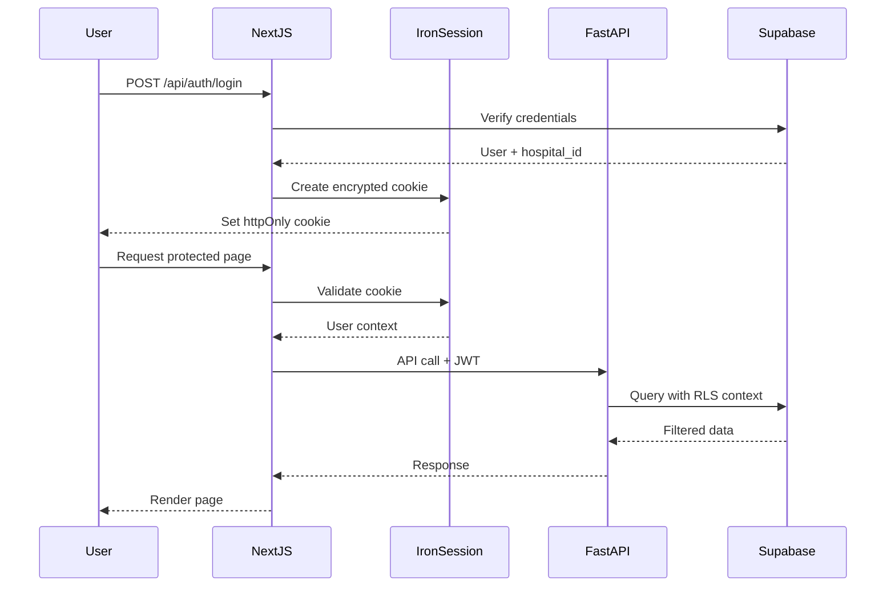
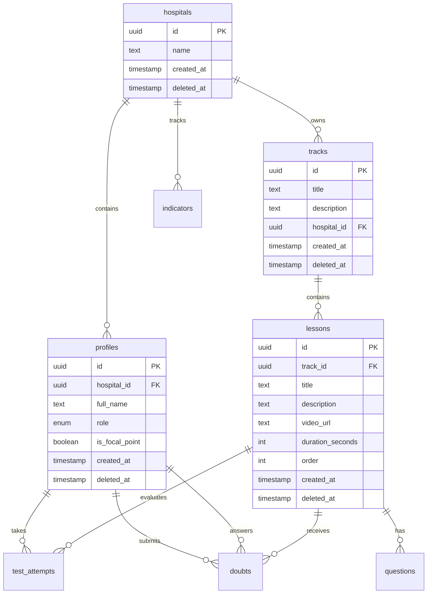

# Design Document: SL Academy Platform

## Overview

SL Academy is a B2B hospital education and management platform that combines microlearning with indicator tracking to improve protocol adherence and patient safety. The platform serves two primary user groups: doctors who consume short educational content (5-15 minute lessons) and take assessments, and managers/directors who monitor training effectiveness through dashboards and manage hospital indicators. The system uses a multi-tenant architecture with hospital-level data isolation, integrating video-based learning, knowledge assessments, doubt management, and performance analytics into a unified PWA experience.

The platform addresses the critical challenge of low protocol adherence in hospitals by providing accessible, bite-sized training content that fits into busy medical schedules, while giving hospital leadership real-time visibility into training completion and its correlation with safety indicators. Focal point doctors serve as training replicators, accessing specialized support materials to conduct in-person training sessions.

## Architecture

### System Architecture Overview

```mermaid
graph TB
    subgraph "Client Layer"
        PWA[PWA - Next.js 16]
        Mobile[Mobile Browser]
        Desktop[Desktop Browser]
    end
    
    subgraph "Application Layer"
        NextJS[Next.js App Router]
        API[FastAPI Backend]
        Auth[Iron-Session Auth]
    end
    
    subgraph "Data Layer"
        Supabase[Supabase PostgreSQL]
        Storage[Supabase Storage]
        RLS[Row Level Security]
    end
    
    subgraph "External Services"
        AI[OpenAI/Claude API]
        Video[Video CDN]
    end
    
    PWA --> NextJS
    Mobile --> NextJS
    Desktop --> NextJS
    NextJS --> Auth
    NextJS --> API
    API --> Supabase
    API --> Storage
    API --> AI
    Supabase --> RLS
    NextJS --> Video
    
    style PWA fill:#2d3748
    style API fill:#2d3748
    style Supabase fill:#2d3748


### Multi-Tenant Isolation Strategy

```mermaid
graph LR
    subgraph "Hospital A"
        UA[Users A] --> DA[Data A]
    end
    
    subgraph "Hospital B"
        UB[Users B] --> DB[Data B]
    end
    
    subgraph "Supabase RLS"
        Policy[RLS Policies]
        Filter[hospital_id Filter]
    end
    
    DA --> Policy
    DB --> Policy
    Policy --> Filter
    
    style Policy fill:#48bb78
    style Filter fill:#48bb78
```

The platform implements strict multi-tenant isolation at the database level using Supabase Row Level Security (RLS). Every data access query is automatically filtered by the authenticated user's hospital_id, preventing any cross-hospital data leakage. This approach ensures that:

- Hospital A users can only access Hospital A data
- Managers see only their hospital's indicators and user activity
- Doctors see only lessons and tracks assigned to their hospital
- All file uploads (images, spreadsheets) are scoped to the owning hospital

### Authentication Flow




## Components and Interfaces

### Frontend Components (Next.js + TypeScript)

#### Core Layout Components

```typescript
interface SidebarProps {
  user: UserProfile
  currentPath: string
}

interface UserProfile {
  id: string
  fullName: string
  role: 'manager' | 'doctor'
  isFocalPoint: boolean
  hospitalId: string
}

interface LayoutProps {
  children: React.ReactNode
  user: UserProfile
  showSidebar?: boolean
}
```

#### Video Player Component

```typescript
interface VideoPlayerProps {
  videoUrl: string
  lessonId: string
  onComplete: () => void
  onProgress: (seconds: number) => void
}

interface VideoMetadata {
  duration: number
  currentTime: number
  isPlaying: boolean
  isFullscreen: boolean
}
```

#### Test Component

```typescript
interface TestQuestion {
  id: string
  questionText: string
  options: string[]
  correctOptionIndex: number
}

interface TestAttempt {
  lessonId: string
  type: 'pre' | 'post'
  answers: Record<string, number>
  score: number
  startedAt: Date
  completedAt?: Date
}
```


#### Doubt Management Components

```typescript
interface Doubt {
  id: string
  profileId: string
  lessonId: string
  text: string
  imageUrl?: string
  status: 'pending' | 'answered'
  answer?: string
  answeredBy?: string
  aiSummary?: string
  createdAt: Date
}

interface KanbanBoardProps {
  doubts: Doubt[]
  onMoveDoubt: (doubtId: string, newStatus: Doubt['status']) => void
  onAnswerDoubt: (doubtId: string, answer: string) => void
}

interface DoubtCardProps {
  doubt: Doubt
  onAnswer?: (answer: string) => void
  viewMode: 'doctor' | 'manager'
}
```

#### Dashboard Components

```typescript
interface Indicator {
  id: string
  hospitalId: string
  name: string
  value: number
  category: string
  referenceDate: Date
}

interface ChartData {
  labels: string[]
  datasets: {
    label: string
    data: number[]
    color: string
  }[]
}

interface DashboardProps {
  indicators: Indicator[]
  testScores: TestAttempt[]
  completionRates: Record<string, number>
}
```


### Backend API Interfaces (FastAPI + Pydantic)

#### Authentication Models

```python
from pydantic import BaseModel, EmailStr
from enum import Enum
from datetime import datetime
from typing import Optional

class UserRole(str, Enum):
    MANAGER = "manager"
    DOCTOR = "doctor"

class LoginRequest(BaseModel):
    email: EmailStr
    password: str

class UserProfile(BaseModel):
    id: str
    hospital_id: str
    full_name: str
    role: UserRole
    is_focal_point: bool
    created_at: datetime
```

#### Track and Lesson Models

```python
class Track(BaseModel):
    id: str
    title: str
    description: str
    hospital_id: str
    created_at: datetime
    deleted_at: Optional[datetime] = None

class Lesson(BaseModel):
    id: str
    track_id: str
    title: str
    description: str
    video_url: str
    duration_seconds: int
    order: int
    created_at: datetime
    deleted_at: Optional[datetime] = None

class LessonDetail(Lesson):
    track: Track
    questions_count: int
```


#### Test and Assessment Models

```python
class QuestionType(str, Enum):
    PRE = "pre"
    POST = "post"

class Question(BaseModel):
    id: str
    lesson_id: str
    type: QuestionType
    question_text: str
    options: list[str]
    correct_option_index: int
    created_at: datetime

class TestAttemptCreate(BaseModel):
    lesson_id: str
    type: QuestionType
    answers: dict[str, int]  # question_id -> selected_option_index

class TestAttemptResponse(BaseModel):
    id: str
    profile_id: str
    lesson_id: str
    type: QuestionType
    score: float
    answers: dict[str, int]
    started_at: datetime
    completed_at: datetime
```

#### Doubt Models

```python
class DoubtStatus(str, Enum):
    PENDING = "pending"
    ANSWERED = "answered"

class DoubtCreate(BaseModel):
    lesson_id: str
    text: str
    image_url: Optional[str] = None

class DoubtUpdate(BaseModel):
    answer: str

class Doubt(BaseModel):
    id: str
    profile_id: str
    lesson_id: str
    text: str
    status: DoubtStatus
    answer: Optional[str] = None
    answered_by: Optional[str] = None
    ai_summary: Optional[str] = None
    created_at: datetime
    deleted_at: Optional[datetime] = None
```


#### Indicator Models

```python
class IndicatorCreate(BaseModel):
    name: str
    value: float
    category: str
    reference_date: datetime

class Indicator(BaseModel):
    id: str
    hospital_id: str
    name: str
    value: float
    category: str
    reference_date: datetime
    created_at: datetime

class IndicatorImportRequest(BaseModel):
    data: list[IndicatorCreate]
    source: str  # "csv", "google_sheets", "manual"
```

## Data Models

### Database Schema (PostgreSQL)

#### Core Entity Relationships




### Table Definitions with Constraints

#### hospitals

```sql
CREATE TABLE hospitals (
    id UUID PRIMARY KEY DEFAULT gen_random_uuid(),
    name TEXT NOT NULL,
    created_at TIMESTAMP WITH TIME ZONE DEFAULT NOW(),
    deleted_at TIMESTAMP WITH TIME ZONE
);

CREATE INDEX idx_hospitals_deleted ON hospitals(deleted_at) WHERE deleted_at IS NULL;
```

#### profiles

```sql
CREATE TYPE user_role AS ENUM ('manager', 'doctor');

CREATE TABLE profiles (
    id UUID PRIMARY KEY REFERENCES auth.users(id) ON DELETE CASCADE,
    hospital_id UUID NOT NULL REFERENCES hospitals(id) ON DELETE CASCADE,
    full_name TEXT NOT NULL,
    role user_role NOT NULL,
    is_focal_point BOOLEAN DEFAULT FALSE,
    created_at TIMESTAMP WITH TIME ZONE DEFAULT NOW(),
    deleted_at TIMESTAMP WITH TIME ZONE,
    CONSTRAINT valid_role CHECK (role IN ('manager', 'doctor'))
);

CREATE INDEX idx_profiles_hospital ON profiles(hospital_id) WHERE deleted_at IS NULL;
CREATE INDEX idx_profiles_role ON profiles(role) WHERE deleted_at IS NULL;
```

#### tracks

```sql
CREATE TABLE tracks (
    id UUID PRIMARY KEY DEFAULT gen_random_uuid(),
    title TEXT NOT NULL,
    description TEXT,
    hospital_id UUID NOT NULL REFERENCES hospitals(id) ON DELETE CASCADE,
    created_at TIMESTAMP WITH TIME ZONE DEFAULT NOW(),
    deleted_at TIMESTAMP WITH TIME ZONE
);

CREATE INDEX idx_tracks_hospital ON tracks(hospital_id) WHERE deleted_at IS NULL;
```


#### lessons

```sql
CREATE TABLE lessons (
    id UUID PRIMARY KEY DEFAULT gen_random_uuid(),
    track_id UUID NOT NULL REFERENCES tracks(id) ON DELETE CASCADE,
    title TEXT NOT NULL,
    description TEXT,
    video_url TEXT NOT NULL,
    duration_seconds INTEGER NOT NULL CHECK (duration_seconds > 0),
    "order" INTEGER NOT NULL CHECK ("order" >= 0),
    created_at TIMESTAMP WITH TIME ZONE DEFAULT NOW(),
    deleted_at TIMESTAMP WITH TIME ZONE,
    UNIQUE(track_id, "order")
);

CREATE INDEX idx_lessons_track ON lessons(track_id, "order") WHERE deleted_at IS NULL;
```

#### questions

```sql
CREATE TYPE question_type AS ENUM ('pre', 'post');

CREATE TABLE questions (
    id UUID PRIMARY KEY DEFAULT gen_random_uuid(),
    lesson_id UUID NOT NULL REFERENCES lessons(id) ON DELETE CASCADE,
    type question_type NOT NULL,
    question_text TEXT NOT NULL,
    options JSONB NOT NULL,
    correct_option_index INTEGER NOT NULL,
    created_at TIMESTAMP WITH TIME ZONE DEFAULT NOW(),
    deleted_at TIMESTAMP WITH TIME ZONE,
    CONSTRAINT valid_options CHECK (jsonb_array_length(options) >= 2),
    CONSTRAINT valid_correct_index CHECK (correct_option_index >= 0)
);

CREATE INDEX idx_questions_lesson ON questions(lesson_id, type) WHERE deleted_at IS NULL;
```


#### test_attempts

```sql
CREATE TABLE test_attempts (
    id UUID PRIMARY KEY DEFAULT gen_random_uuid(),
    profile_id UUID NOT NULL REFERENCES profiles(id) ON DELETE CASCADE,
    lesson_id UUID NOT NULL REFERENCES lessons(id) ON DELETE CASCADE,
    type question_type NOT NULL,
    score NUMERIC(5,2) NOT NULL CHECK (score >= 0 AND score <= 100),
    answers JSONB NOT NULL,
    started_at TIMESTAMP WITH TIME ZONE DEFAULT NOW(),
    completed_at TIMESTAMP WITH TIME ZONE
);

CREATE INDEX idx_test_attempts_profile ON test_attempts(profile_id, completed_at);
CREATE INDEX idx_test_attempts_lesson ON test_attempts(lesson_id, type);
```

#### doubts

```sql
CREATE TYPE doubt_status AS ENUM ('pending', 'answered');

CREATE TABLE doubts (
    id UUID PRIMARY KEY DEFAULT gen_random_uuid(),
    profile_id UUID NOT NULL REFERENCES profiles(id) ON DELETE CASCADE,
    lesson_id UUID NOT NULL REFERENCES lessons(id) ON DELETE CASCADE,
    text TEXT NOT NULL,
    status doubt_status DEFAULT 'pending',
    answer TEXT,
    answered_by UUID REFERENCES profiles(id) ON DELETE SET NULL,
    ai_summary TEXT,
    created_at TIMESTAMP WITH TIME ZONE DEFAULT NOW(),
    deleted_at TIMESTAMP WITH TIME ZONE
);

CREATE INDEX idx_doubts_status ON doubts(status, created_at) WHERE deleted_at IS NULL;
CREATE INDEX idx_doubts_lesson ON doubts(lesson_id) WHERE deleted_at IS NULL;
```


#### indicators

```sql
CREATE TABLE indicators (
    id UUID PRIMARY KEY DEFAULT gen_random_uuid(),
    hospital_id UUID NOT NULL REFERENCES hospitals(id) ON DELETE CASCADE,
    name TEXT NOT NULL,
    value NUMERIC NOT NULL,
    category TEXT NOT NULL,
    reference_date DATE NOT NULL,
    created_at TIMESTAMP WITH TIME ZONE DEFAULT NOW(),
    deleted_at TIMESTAMP WITH TIME ZONE
);

CREATE INDEX idx_indicators_hospital ON indicators(hospital_id, reference_date) WHERE deleted_at IS NULL;
CREATE INDEX idx_indicators_category ON indicators(category, reference_date) WHERE deleted_at IS NULL;
```

### Row Level Security (RLS) Policies

#### Multi-Tenant Isolation Policy Template

```sql
-- Enable RLS on all tables
ALTER TABLE hospitals ENABLE ROW LEVEL SECURITY;
ALTER TABLE profiles ENABLE ROW LEVEL SECURITY;
ALTER TABLE tracks ENABLE ROW LEVEL SECURITY;
ALTER TABLE lessons ENABLE ROW LEVEL SECURITY;
ALTER TABLE questions ENABLE ROW LEVEL SECURITY;
ALTER TABLE test_attempts ENABLE ROW LEVEL SECURITY;
ALTER TABLE doubts ENABLE ROW LEVEL SECURITY;
ALTER TABLE indicators ENABLE ROW LEVEL SECURITY;

-- Helper function to get current user's hospital_id
CREATE OR REPLACE FUNCTION auth.user_hospital_id()
RETURNS UUID AS $$
  SELECT hospital_id FROM profiles WHERE id = auth.uid()
$$ LANGUAGE SQL SECURITY DEFINER;
```


#### RLS Policies by Table

```sql
-- Profiles: Users can only see profiles from their hospital
CREATE POLICY profiles_select_policy ON profiles
    FOR SELECT
    USING (hospital_id = auth.user_hospital_id() AND deleted_at IS NULL);

-- Tracks: Users can only see tracks from their hospital
CREATE POLICY tracks_select_policy ON tracks
    FOR SELECT
    USING (hospital_id = auth.user_hospital_id() AND deleted_at IS NULL);

-- Managers can insert/update tracks
CREATE POLICY tracks_insert_policy ON tracks
    FOR INSERT
    WITH CHECK (
        hospital_id = auth.user_hospital_id() 
        AND EXISTS (
            SELECT 1 FROM profiles 
            WHERE id = auth.uid() 
            AND role = 'manager'
        )
    );

-- Lessons: Accessible via track's hospital_id
CREATE POLICY lessons_select_policy ON lessons
    FOR SELECT
    USING (
        EXISTS (
            SELECT 1 FROM tracks 
            WHERE tracks.id = lessons.track_id 
            AND tracks.hospital_id = auth.user_hospital_id()
        )
        AND deleted_at IS NULL
    );

-- Test Attempts: Users can see their own attempts
CREATE POLICY test_attempts_select_policy ON test_attempts
    FOR SELECT
    USING (profile_id = auth.uid());

-- Users can insert their own test attempts
CREATE POLICY test_attempts_insert_policy ON test_attempts
    FOR INSERT
    WITH CHECK (profile_id = auth.uid());
```


```sql
-- Doubts: Users can see doubts from their hospital's lessons
CREATE POLICY doubts_select_policy ON doubts
    FOR SELECT
    USING (
        EXISTS (
            SELECT 1 FROM lessons l
            JOIN tracks t ON l.track_id = t.id
            WHERE l.id = doubts.lesson_id
            AND t.hospital_id = auth.user_hospital_id()
        )
        AND deleted_at IS NULL
    );

-- Doctors can insert doubts
CREATE POLICY doubts_insert_policy ON doubts
    FOR INSERT
    WITH CHECK (profile_id = auth.uid());

-- Managers can update doubts (answer them)
CREATE POLICY doubts_update_policy ON doubts
    FOR UPDATE
    USING (
        EXISTS (
            SELECT 1 FROM profiles 
            WHERE id = auth.uid() 
            AND role = 'manager'
            AND hospital_id = auth.user_hospital_id()
        )
    );

-- Indicators: Users can only see their hospital's indicators
CREATE POLICY indicators_select_policy ON indicators
    FOR SELECT
    USING (hospital_id = auth.user_hospital_id() AND deleted_at IS NULL);

-- Managers can insert/update indicators
CREATE POLICY indicators_insert_policy ON indicators
    FOR INSERT
    WITH CHECK (
        hospital_id = auth.user_hospital_id()
        AND EXISTS (
            SELECT 1 FROM profiles 
            WHERE id = auth.uid() 
            AND role = 'manager'
        )
    );
```


### Database Triggers and Automation

```sql
-- Trigger: Auto-update updated_at timestamp
CREATE OR REPLACE FUNCTION update_updated_at_column()
RETURNS TRIGGER AS $$
BEGIN
    NEW.updated_at = NOW();
    RETURN NEW;
END;
$$ LANGUAGE plpgsql;

-- Trigger: Auto-create profile on user signup
CREATE OR REPLACE FUNCTION handle_new_user()
RETURNS TRIGGER AS $$
BEGIN
    INSERT INTO profiles (id, hospital_id, full_name, role)
    VALUES (
        NEW.id,
        (NEW.raw_user_meta_data->>'hospital_id')::UUID,
        NEW.raw_user_meta_data->>'full_name',
        (NEW.raw_user_meta_data->>'role')::user_role
    );
    RETURN NEW;
END;
$$ LANGUAGE plpgsql SECURITY DEFINER;

CREATE TRIGGER on_auth_user_created
    AFTER INSERT ON auth.users
    FOR EACH ROW
    EXECUTE FUNCTION handle_new_user();
```

## Algorithmic Pseudocode

### Main Learning Workflow

```pascal
ALGORITHM completeLessonWorkflow(userId, lessonId)
INPUT: userId (UUID), lessonId (UUID)
OUTPUT: completionResult (CompletionStatus)

BEGIN
  ASSERT userId IS NOT NULL AND lessonId IS NOT NULL
  ASSERT userHasAccessToLesson(userId, lessonId) = true
  
  // Step 1: Take pre-test
  preTestQuestions ← fetchQuestions(lessonId, "pre")
  ASSERT preTestQuestions.length > 0
  
  preTestAnswers ← collectUserAnswers(preTestQuestions)
  preTestScore ← calculateScore(preTestAnswers, preTestQuestions)
  saveTestAttempt(userId, lessonId, "pre", preTestScore, preTestAnswers)
  
  // Step 2: Watch lesson video
  videoMetadata ← fetchLessonVideo(lessonId)
  watchProgress ← trackVideoProgress(userId, lessonId)
  
  WHILE watchProgress.completed = false DO
    ASSERT watchProgress.currentTime <= videoMetadata.duration
    updateProgress(userId, lessonId, watchProgress.currentTime)
  END WHILE
  
  // Step 3: Take post-test
  postTestQuestions ← fetchQuestions(lessonId, "post")
  ASSERT postTestQuestions.length > 0
  
  postTestAnswers ← collectUserAnswers(postTestQuestions)
  postTestScore ← calculateScore(postTestAnswers, postTestQuestions)
  saveTestAttempt(userId, lessonId, "post", postTestScore, postTestAnswers)
  
  // Step 4: Calculate improvement and generate recommendations
  improvement ← postTestScore - preTestScore
  
  IF improvement < IMPROVEMENT_THRESHOLD THEN
    recommendations ← generateAIRecommendations(userId, lessonId, postTestScore)
  END IF
  
  ASSERT postTestScore >= 0 AND postTestScore <= 100
  
  RETURN {
    completed: true,
    preScore: preTestScore,
    postScore: postTestScore,
    improvement: improvement,
    recommendations: recommendations
  }
END
```


**Preconditions:**
- userId and lessonId are valid UUIDs
- User has access to the lesson (same hospital)
- Lesson has both pre and post test questions
- Video URL is accessible

**Postconditions:**
- Two test attempts are recorded (pre and post)
- Video progress is tracked
- If improvement is low, recommendations are generated
- Completion status is returned with all scores

**Loop Invariants:**
- Video progress never exceeds video duration
- All test scores remain between 0 and 100

### Test Scoring Algorithm

```pascal
ALGORITHM calculateScore(userAnswers, questions)
INPUT: userAnswers (Map<questionId, selectedIndex>), questions (Array<Question>)
OUTPUT: score (Float between 0 and 100)

BEGIN
  ASSERT questions.length > 0
  ASSERT userAnswers.size = questions.length
  
  correctCount ← 0
  totalQuestions ← questions.length
  
  FOR each question IN questions DO
    ASSERT question.id IN userAnswers.keys()
    
    selectedIndex ← userAnswers[question.id]
    correctIndex ← question.correctOptionIndex
    
    IF selectedIndex = correctIndex THEN
      correctCount ← correctCount + 1
    END IF
  END FOR
  
  score ← (correctCount / totalQuestions) * 100
  
  ASSERT score >= 0 AND score <= 100
  ASSERT correctCount <= totalQuestions
  
  RETURN score
END
```

**Preconditions:**
- questions array is not empty
- userAnswers contains an answer for every question
- All selectedIndex values are valid (within option bounds)

**Postconditions:**
- Score is between 0 and 100 inclusive
- Score accurately reflects percentage of correct answers
- No side effects on input data

**Loop Invariants:**
- correctCount never exceeds totalQuestions
- All processed questions have valid answers


### Doubt Management Workflow

```pascal
ALGORITHM processDoubtWorkflow(doubtId, managerId)
INPUT: doubtId (UUID), managerId (UUID)
OUTPUT: processedDoubt (Doubt)

BEGIN
  ASSERT doubtId IS NOT NULL AND managerId IS NOT NULL
  ASSERT managerHasRole(managerId, "manager") = true
  
  // Step 1: Fetch doubt with validation
  doubt ← fetchDoubt(doubtId)
  ASSERT doubt IS NOT NULL
  ASSERT doubt.status = "pending"
  ASSERT doubtBelongsToManagerHospital(doubt, managerId) = true
  
  // Step 2: Generate AI summary if not exists
  IF doubt.aiSummary IS NULL THEN
    doubt.aiSummary ← generateAISummary(doubt.text)
  END IF
  
  // Step 3: Manager provides answer
  answer ← getManagerAnswer()
  ASSERT answer IS NOT NULL AND answer.length > 0
  
  // Step 4: Update doubt record
  doubt.answer ← answer
  doubt.answeredBy ← managerId
  doubt.status ← "answered"
  
  updateDoubt(doubt)
  
  // Step 5: Notify doctor (optional)
  notifyDoctor(doubt.profileId, doubtId)
  
  ASSERT doubt.status = "answered"
  ASSERT doubt.answeredBy = managerId
  
  RETURN doubt
END
```

**Preconditions:**
- doubtId exists in database
- managerId is a valid manager user
- Doubt is in pending status
- Manager and doubt belong to same hospital

**Postconditions:**
- Doubt status is changed to "answered"
- Answer text is stored
- answeredBy field references the manager
- Doctor is notified of the answer

**Loop Invariants:** N/A (no loops in this algorithm)


### Indicator Import Algorithm

```pascal
ALGORITHM importIndicators(hospitalId, data, source)
INPUT: hospitalId (UUID), data (Array<IndicatorData>), source (String)
OUTPUT: importResult (ImportResult)

BEGIN
  ASSERT hospitalId IS NOT NULL
  ASSERT data.length > 0
  ASSERT source IN ["csv", "google_sheets", "manual"]
  
  successCount ← 0
  errorCount ← 0
  errors ← []
  
  FOR each indicatorData IN data DO
    ASSERT indicatorData.name IS NOT NULL
    ASSERT indicatorData.value IS NUMERIC
    ASSERT indicatorData.referenceDate IS VALID_DATE
    
    // Validate indicator data
    IF NOT isValidIndicator(indicatorData) THEN
      errorCount ← errorCount + 1
      errors.append({
        row: indicatorData.rowNumber,
        error: "Invalid indicator data"
      })
      CONTINUE
    END IF
    
    // Check for duplicates
    existingIndicator ← findIndicator(
      hospitalId, 
      indicatorData.name, 
      indicatorData.referenceDate
    )
    
    IF existingIndicator IS NOT NULL THEN
      // Update existing
      updateIndicator(existingIndicator.id, indicatorData)
    ELSE
      // Create new
      createIndicator(hospitalId, indicatorData)
    END IF
    
    successCount ← successCount + 1
  END FOR
  
  ASSERT successCount + errorCount = data.length
  
  RETURN {
    success: successCount,
    errors: errorCount,
    errorDetails: errors,
    source: source
  }
END
```

**Preconditions:**
- hospitalId is valid
- data array is not empty
- source is one of the allowed values
- All indicator data has required fields

**Postconditions:**
- All valid indicators are imported or updated
- Invalid indicators are logged in errors array
- Total processed equals success + error count
- No duplicate indicators for same date

**Loop Invariants:**
- successCount + errorCount equals number of processed items
- All processed indicators are validated
- Hospital isolation is maintained
